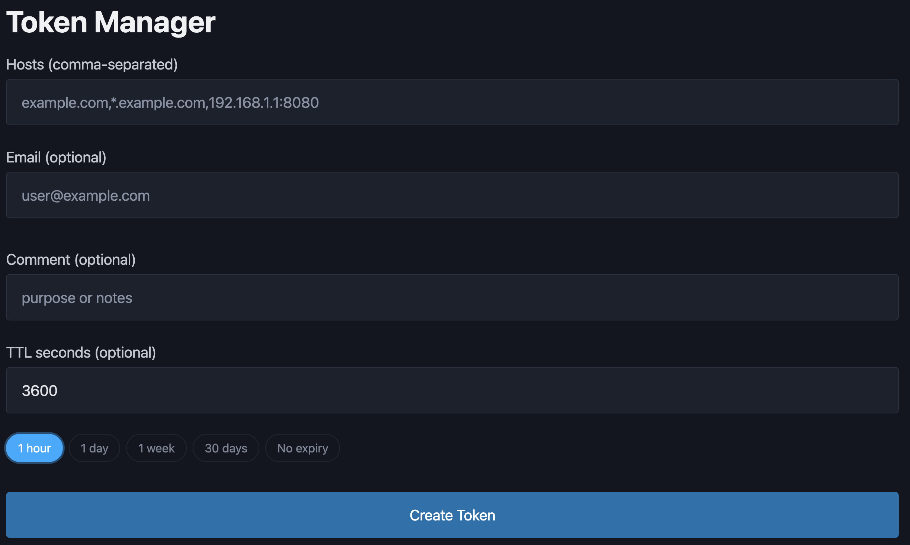

# wicket

> Share your self-hosted MCP servers, APIs, and dashboards with a few friends. No identity provider needed.


I wanted to share my self-hosted service with 3 friends. And let one of them
into my MCP server deployed on the same machine, but not the other two.

I needed:

- token-based auth
- simple admin panel
- be able to attach to the different proxies

I looked at what existed:

- **Authelia / Authentik / Zitadel**: full SSO, designed for companies. Overkill.
- **tinyauth**: it does user/session auth with login UI; I want pre-shared bearer tokens for API clients, not browser sessions.
- **OAuth2-proxy**: needs an upstream identity provider I'd have to run too.
- **nginx basic auth**: no per-resource rules, no rotation, no administration.


So I built this: a FastAPI service that your reverse proxy (Caddy or Traefik) calls via forward-auth.
Create a bearer token in the admin UI, assign it to specific hostnames, hand it to your friend. 

They add `Authorization: Bearer <token>` to requests.



---

## Who this is for

- You self-host a few services: MCP servers, scrapers, pet projects, internal APIs, dashboards
- You want to share them with a small trusted group
- You don't want to run an identity provider
- You don't want to depend on a third-party SaaS

## Who this is not for

- You need real SSO, audit logs, or user-attribute policies: use Authelia / Authentik / Zitadel
- You have hundreds of users: the admin UI doesn't have search or grouping yet, so it gets painful fast.

## What you get

- Bearer-token auth with **per-host ACL**: one token can grant access to multiple services, or just one
- **Tiny admin UI** for issuing, and revoking tokens
- **Token TTLs** for auto-expiry

---

## Quick start

```bash
git clone https://github.com/trofkm/wicket
cd wicket
cp env.example .env   # set env variables
```

### SQLite

```bash
docker compose up --build
```

### Redis

```bash
docker compose -f docker-compose.redis.yml up --build
```


Open `http://localhost:8000` for the admin UI. Sign in with `ADMIN_USER` /
`ADMIN_PASS`, create a token for your service's hostname, and wire up your
proxy:


### Caddy

```caddyfile
yourmcp.example.com {
    forward_auth wicket:8000 {
        uri /auth
    }
    reverse_proxy yourmcp:3002
}
```

### Traefik (Docker labels)

```yaml
services:
  yourmcp:
    labels:
      - "traefik.http.routers.yourmcp.middlewares=wicket-auth@docker"
      - "traefik.http.middlewares.wicket-auth.forwardauth.address=http://wicket:8000/auth"
      - "traefik.http.middlewares.wicket-auth.forwardauth.trustForwardHeader=true"
```


> See [`example/`](example/) for full-stack Docker Compose setups.

---

## How it works

```
  Client
    │
    │  GET https://yourmcp.example.com/
    │  Authorization: Bearer <token>
    ▼
  Reverse proxy
    │
    │  forward-auth: GET /auth
    │  X-Forwarded-Host: yourmcp.example.com
    ▼
  wicket (this service)
    │
    │  lookup in storage
    │  is the host in this token's allowlist?
    ▼
```

The admin UI shows you the raw token only once, on creation.

---

## API reference

### `GET /auth`

Your reverse proxy calls this endpoint. Returns the verdict for a single request.

| Header                  | Notes                                         |
|-------------------------|-----------------------------------------------|
| `Authorization`         | `Bearer <token>`,  **Required.**              |
| `X-Forwarded-Host`      | Set by the reverse proxy. **Required.**       |

Responses: `200 OK` (allow), `400` (missing `X-Forwarded-Host`), `401` (missing/invalid token or host not allowed), `503` (store unavailable).

### `GET /healthz`

Always `200 OK`. Liveness probe.

### `GET /readyz`

`200 OK` when the storage backend is reachable, otherwise `503`. Readiness probe.

### `GET /metrics`

Prometheus metrics endpoint. Exposes:

| Metric | Type | Description |
|--------|------|-------------|
| `http_requests_total` | counter | Request count by method, handler, and status |
| `http_request_duration_seconds` | histogram | Request latency |
| `wicket_store_health` | gauge | Storage health (1 = ok, 0 = down) |

### Admin UI (Basic Auth)

- `GET /`: token manager
- `POST /create_token`: fields: `hosts` (required, comma-separated), `email`, `comment`, `ttl_seconds`
- `POST /delete_token`: field: `token`

---

## Storage backends

Supports two storage backends, selected via `STORAGE_BACKEND`:

| Backend | Best for | Notes |
|---------|----------|-------|
| `sqlite`| Single instance, simple setup | Easy to use. Fits 99% of usecase. |
| `redis` | Multiple instances, or if you already run Redis. | Use this if you don't like sqlite or you have highload. |


## Environment variables

| Variable                      | Default       | Notes                                |
|-------------------------------|---------------|--------------------------------------|
| `PEPPER`                      | *required*    | Server-side secret for hashing       |
| `ADMIN_USER`                  | *required*    | Admin UI Basic Auth                  |
| `ADMIN_PASS`                  | *required*    | Admin UI Basic Auth                  |
| `STORAGE_BACKEND`             | `sqlite`      | `sqlite` or `redis`                  |
| `SQLITE_PATH`                 | `/data/tokens.db` | Path to SQLite file (sqlite backend only) |
| `TOKEN_TTL_SECONDS`           | `0`           | `0` = no default TTL                 |
| `AUTH_FAILURE_WINDOW_SECONDS` | `60`          | Sliding window for brute-force detection (seconds) |
| `AUTH_MAX_FAILURES`           | `10`          | Max failed auth attempts per window before 429     |

**Redis backend only**:

| Variable                      | Default       | Notes                                |
|-------------------------------|---------------|--------------------------------------|
| `REDIS_HOST`                  | `localhost`   |                                      |
| `REDIS_PORT`                  | `6379`        |                                      |
| `REDIS_DB`                    | `0`           |                                      |
| `REDIS_USERNAME`              | *(none)*      | Optional                             |
| `REDIS_PASSWORD`              | *(none)*      | Optional                             |
| `REDIS_TLS`                   | `false`       |                                      |
| `REDIS_TLS_SKIP_VERIFY`       | `false`       |                                      |
| `REDIS_CA_CERTS`              | *(none)*      | Path to CA bundle for TLS verify     |
| `REDIS_SOCKET_TIMEOUT`        | `5.0`         | Timeout per operation (seconds)      |
| `REDIS_SOCKET_CONNECT_TIMEOUT`| `2.0`         | Timeout for initial connect (seconds)|
| `REDIS_MAX_CONNECTIONS`       | `20`          | Connection pool size                 |
| `REDIS_HEALTH_CHECK_INTERVAL` | `30`          | Connection health check (seconds)    |
| `REDIS_RETRY_COUNT`           | `3`           | Retries on errors                    |
| `REDIS_CLIENT_NAME`           | `wicket`         | Shows in redis `CLIENT LIST`      |

---

## Security notes

- **Front this with HTTPS**  Bearer tokens are sensitive. Don't send them over plain HTTP.
- The admin UI uses Basic Auth. For exposed deployments, add an IP allowlist, a NetworkPolicy, mTLS, or put the UI behind a separate route.

---

## Troubleshooting

| Symptom | Likely cause |
|---|---|
| `400 missing X-Forwarded-Host` | Reverse proxy isn't setting `X-Forwarded-Host`. Check `trustForwardHeader` or equivalent. |
| `401 missing bearer token` | Reverse proxy isn't forwarding `Authorization` |
| `401 invalid token`        | Token isn't in the store (deleted/expired), or the host is not in the token's allowlist |
| `503 store unavailable`    | Redis is down, or no write permissions for sqlite |

---

## License

MIT
